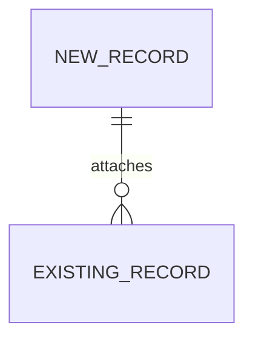

# Design document format

Load this file only when writing `.design/<name>.md` — after the verdict is confirmed, or after recording a committed decision. Do not load it during the interview.

Section headings stay as they are — the next skill refers to them by name — while the prose follows the language of the document and identifiers are never translated. The document is for humans first: `tlc-plan` copies Decisions and the Shape literals, and Roadmap is the index a person reads before either.

Replace every placeholder with a concrete value, or omit the section. A heading with "N/A" under it does not appear.

## Template

Write `.design/<name>.md`.

````markdown
# <Title>

> Plan this with **tlc-plan** (`<repo-relative path, when the project vendors the skill>`).
> Decisions below carry the literal shape - copy them, do not re-derive them.

## Situation

- Project: <in steady use | not shipped yet | in active construction>
- Decision: <open | committed by <who>, <when>, in <roadmap, cycle, document>>
- In flight: <branch, ticket, or earlier design document this touches> - <what it changes here>
- At stake: <what being wrong costs - reverted in an afternoon | expensive | one-way>

## Problem

<Pain: who hurts, named; what it costs today, in a unit the business feels; what happens if nothing changes. Absence: who cannot do this, and what they do instead. Construction: what this piece was promised to make possible, what stalls without it, and why now rather than after the next piece. No solution proposed.>

## Evidence

- <number that moved the decision> - <where it came from>
- <question nobody can answer today> - <what it would take to measure it>

## Journey

<The sequence, confirmed. Then each state that matters and what should happen there - empty, first run, retry, expired, unauthorised, abandoned. For work with no end user, the operational sequence.>

## Verdict

<build | smaller or different | not now | do not build> - <the reason, as cost of doing nothing against cost of doing something>. Confirmed by <who>, <date>.

<Where the decision arrived committed: "already committed - see Situation", and nothing else unless the problem work contradicts it, which goes here in full.>

Cheaper paths considered: <each one, and the line that discarded it>.

## Success

- Worked if: <outcome, in the problem's own unit> - by <when>
- Early signal: <visible in days> - <what it looks like if the bet is going wrong>
- Review: <date or trigger> - <who looks>
- <Not measurable: the observable proxy, or what would have to be instrumented and whether that is in scope>

## Boundary

In: <what this covers>
Out: <excluded> - <why>

## Prior art

- <who solved a version of this> - <what we take from it>
- <the failure they report> - <what it changes here>
- <a benchmark that argues for something heavier> - <the condition of theirs we do not share>
- <nothing comparable found | not checked: no web access>

## Shape

<Two or three sentences: the bet, and what it costs to change later.>



Omit the mermaid block unless Adds names related tables or entities. The diagram shows those records and the existing ones they attach to. Never draw the journey here.

### Adds

- <literal that does not exist today: table, route, model, screen, job>

### Changes

- <existing identifier> → <what happens to it>

### Leaves

- <named in Boundary Out, so the reader does not hunt>

<The heavier alternative, and the condition that would make it win. One sentence when it is not live; a paragraph when it is. Not a second Adds list unless that shape is live.>

<Also in the field, for perspective and not as candidates: <approach> - <what removes it here>. One line each. Omit the block when there is nothing to show.>

## Roadmap

| Block | Delivers | Clarity |
|---|---|---|
| <staffable slice, not a micro-decision> | <what exists when this block is done> | clear \| rfc \| spike \| design \| open |

## Decisions

| Decision | Choice | Why this | Alternative, and what would make it win | Reversibility |
|---|---|---|---|---|
| <what> | <literal shape: schema, endpoint, enum value, provider setting> | <the property that decided it> | <the option, and its condition> | one-way / costly / reversible |

## Needs an RFC

High impact, not clear enough to settle here. Not decided.

1. <question> - <what it blocks, and what makes it consequential>

## Needs a spike

1. <question only building answers> - <what each answer changes> - <when it stops>

## Needs design

Cannot be planned until somebody draws it.

1. <screen or flow> - <the states from the journey the design has to answer for>

## Open

Low impact. A default was taken; the diff is where it gets reviewed.

1. <question> - <default taken>

## Sources

- <link or quoted lines, when a source has no address> - <what it settles>
- <drawn screens: public link or path, when Needs design has been answered>
````

## Section notes

**Evidence** keeps the entries that say "we cannot know this" - they are the ones a reader argues with, and the argument is usually where the instrumentation decision gets made. The document's order is fixed; the order you *ask* in follows the frontier.

**Verdict** carries who confirmed it and when. Not ceremony: the whole document downstream rests on somebody having agreed to spend the money, and six weeks later nobody remembers whether that happened or whether it was assumed.

**Success** is what makes the verdict a bet instead of an opinion. A person checks it after release, never a test at merge; the only part of this section the next skill builds is instrumentation that does not exist yet.

**Prior art** is four lines at most and each has to change something here. A row that only reports what another company does is the section failing. "Not checked: no web access" is a complete row.

**Shape** is the first technical thing a human reads. Where Adds names related tables or entities, a mermaid `erDiagram` sits under the bet showing how they attach to each other and to records that already exist - the list is the diff, the diagram is the seating. Skip it where there is nothing to relate, and never draw the journey here. Identifiers stay untranslated.

**Roadmap** is one row per block a person could staff, never one per Decision, with clarity exactly `clear`, `rfc`, `spike`, `design`, or `open`. Where the work is one block it is one row, and one row is not a table - say it in a line. Every clear row is backed by Decision literals and every other row appears in its matching handoff section; no block may live only in Roadmap.

**Decisions** is what the next skill reads most closely. `Choice` holds the literal shape someone will copy, never a description of it. `Reversibility` is the handoff - only what is hard to reverse reaches the task's `Decided`, and marking it here stops the next skill guessing. The alternative carries its condition, because "we rejected X" ages badly where "we rejected X because we do not expect a second region" can be checked against reality later.

**Needs an RFC**, **Needs a spike** and **Needs design** are outputs, not apologies. A discovery returning two decisions, one RFC and one spike has done its job; one returning eleven confident decisions on a problem nobody understood has not.
