# Task document format

Load this file only when writing `.tasks/<name>.md` — after the cut, the grounding, the surface walk, and the sweep. Do not load it during Cut.

Section headings stay as they are — the next skill refers to them by name — while the prose follows the language of the document and identifiers are never translated. The document is for humans first: `tlc-implement` copies criteria into checks, and nothing under `Unresolved` gets settled while building.

Replace every placeholder with a concrete value, or omit the section. A heading with "N/A" under it does not appear.

## Template

Write `.tasks/<name>.md`, one file per task:

````markdown
# <Title>

> Build this with **tlc-implement** (`<repo-relative path, when the project vendors the skill>`).
> Every criterion below becomes a check with a proof, referenced by its number. Nothing under
> `Unresolved` gets settled while building.

## Intent

<The problem, in the present tense, with no solution in it: what is true today that should not be,
who pays for it, and what it costs them. Copy the evidence the source gives.>

<The change: what is different for a user when this ships. For interface work, name the screen and
the flow, and link the design - it is a source, not an illustration.>

<N criteria in M slices · K one-way doors · Q open, of which B block>

## Criteria

One observable outcome per line, with the concrete value. State the precondition when the
outcome depends on one. On a screen, every state that matters is its own line: empty, loading,
error, unauthorised, and it names the screen the design gives it. Use whichever shape the criterion
actually has - most are When/Then, and the list below is a menu, not a quota. Headings are the
slices; numbering runs across the whole task.

### <slice - the outcome someone can watch>

1. Given <state>, when <trigger>, then <observable outcome with the concrete value>.
2. When <trigger>, then <observable outcome>.

### <slice>

3. While <state holds>, <observable outcome>.
4. If <condition goes wrong>, then <observable outcome>.
5. Always, <invariant with the concrete value>.

## States

Only when the task changes a lifecycle. Every edge carries the criterion that states it.

```mermaid
stateDiagram-v2
    <From> --> <To>: <trigger> (<criterion number>)
    <ExistingState> --> <ExistingState>: <unchanged - label as existing>
```



## Out of scope

- <excluded capability> - <why>

## Observable

Every item of every surface this task exposes. A landing is a criterion already written, `existing`, `n/a`, or `Unresolved` - never a behaviour the walk invented.

| Surface | Decision | Landing |
| --- | --- | --- |
| screen `<name>` | empty state | 1 |
| screen `<name>` | error state | Unresolved 2 |
| screen `<name>` | destructive action confirms | existing - <the pattern already in use> |
| API `<METHOD> /<path>` | error shape and codes | n/a - <why it does not apply> |

<Or:> `None - no user-facing surface`

## Swept

Where each unwritten requirement landed. All nine, one line each, every time.

- validation: <criterion number>
- failure modes: <criterion number>
- idempotency and retry: <criterion number>
- authorization: existing - <the guard or policy that already covers this>
- concurrency and ordering: <criterion number>
- data lifecycle: n/a - <why it does not apply>
- external-dependency failure: <criterion number>
- state transitions: <criterion number>
- observability: Unresolved <number>

## Impact

What already exists and gets disturbed. "Nothing" is a valid answer; a missing row is not.

| Front | What changes |
|---|---|
| domain | new term: `<Name>` - <one-line definition>, lives in <module> |
| domain | existing term: `<Name>` meant <x>, now means <y> - <who branches on it today> |
| stored data | <backfill now / migrate on read / dual write / nothing to migrate> |

## Decided

Only what is hard to reverse, with the literal shape. `None - <why nothing here is one-way>` is
a valid row.

| Decision | Shape | Alternative rejected |
|---|---|---|
| <what was decided> | <schema, endpoint + body, enum value, event payload, dependency> | <the option and the property that disqualified it> |

## Relations

Only when the task changes the shape of stored data, and only what `Decided` already settled:
entities, cardinality, and the constraints that are one-way. No columns, no types.

```mermaid
erDiagram
    <Entity> ||--o{ <Entity> : <verb>
    <Entity> ||--|| <Entity> : "<verb> - unique, decision <row>"
```

## Surface

Only when the task adds or changes an interface consumed outside it. The signature, not a
specification.

| Route | In | Out | Status | Criteria |
|---|---|---|---|---|
| `<METHOD> /<path>` | `<field>`, `<field>` | `<field>`, `<field>` | `<code>`, `<code>` | <numbers> |

## Sources

- <link> - <what it settles>
- <design> - **binding for the interface**: screens <ids>, and where the copy lives

This task is the record of decision. If a linked document diverges, ask before building.

## Unresolved

Questions the source does not settle and asking did not close. Nobody fills these in while
building. `None` when nothing is open — one row, Question is `None`, other cells empty. A missing
section is not an answer.

| # | Kind | Question | Until answered |
|---|---|---|---|
| 1 | blocks | <question> | <which criterion cannot be satisfied until it is answered> |
| 2 | blocks go-live | <question> | <what cannot be switched on for real users until it is answered> |
| 3 | open | <question> | <what stays imprecise, and what was written in the meantime> |
````

**The handoff line** comes first because whoever opens this file was handed a path and nothing else - increasingly a model, with no memory of the conversation that produced the task. It names the skill that turns criteria into checks, so the reader does not improvise a plan out of a document that deliberately contains none, and it repeats the one rule that gets broken under pressure: an open question is not an invitation to decide. Name the skill, never a path - where it is installed differs per repository, and a link that does not resolve teaches the reader to skip the line. Add a repo-relative path beside the name only where the project vendors the skill in-tree, and only as a fallback: a skill configured as explicitly-invoked-only never appears in an agent's list, and in a headless or cloud run the name on its own is a reference nobody can act on. A path into somebody's home directory is the one that goes stale - never write that.

**Intent** is two paragraphs because it is two questions, and asking both in one breath reliably returns only the second. The change is already in the source and costs nothing to restate; the problem has to be recovered, so that is the half that gets dropped. Splitting them makes the omission visible.

Write the problem in the present tense with no solution inside it. "We have no Stripe integration" is not a problem - it is the absence of this task's answer, and a problem phrased that way can only ever justify the thing already chosen. Say what is true today that should not be, who pays for it and what it costs them: "anyone evaluating the product has to enter a card first" is a sentence someone can disagree with, and being disagreeable is the test. Copy whatever evidence the source gives, literally - a conversion figure, a support volume, a date somebody else set. Where it gives none, say so instead of manufacturing urgency.

When the source states no problem at all, that is a gap like any other and it comes back as a question. Not blocking, since the criteria stand without it, but worth asking, because decided work whose problem nobody can state is the likeliest to be the wrong work. The problem is also what makes the rest reviewable: every rejected alternative in `Decided` argues about means, so with the end unwritten a reviewer can confirm the task is well-formed and never that it is right.

**Criteria** are numbered because everything downstream refers to them by number - a proof, a review comment, a question. One **outcome** per line, which is not one assertion: a single outcome usually has several observable facets, and a trial that comes back `Trialing`, sets `trialEndsAt` and leaves a subscription at the provider is one criterion rather than three. Split when a line carries two triggers or two outcomes that can succeed independently - never merely because it contains "and". Splitting facets into separately provable pieces is the next skill's job, where each check owes exactly one proof. Given/When/Then only where a precondition changes the outcome; a bare When reads better and says the same thing.

When/Then answers a trigger, and three kinds of criterion have no trigger to answer. An **invariant** holds always - "a paused subscription never grants access" - and inventing a moment for it moves the criterion off what it actually claims. A **state-driven** outcome holds while something is true rather than at an instant: "while the trial is active, usage is recorded and not billed". An **unwanted condition** responds to something going wrong rather than to someone acting: "if the provider does not answer within 10s, the charge is not retried". Give each its own shape - `Always`, `While`, `If`. Squeezed into a When, they come out as a subordinate clause inside some other criterion, which is exactly where failure handling and invariants get lost.

**Write the connectives in the language of the task.** `Given`, `When`, `Then`, `While`, `If` and `Always` are shapes, not keywords, and nothing parses them - a task written in Portuguese writes `Dado`, `Quando`, `Então`. A document that switches language mid-sentence costs the reader a beat on every line and buys nothing. Three tiers, and only the middle one moves: the section headings stay as they are, because they are a schema that this skill and the next one both refer to by name; the prose and the connectives follow the document; identifiers are never translated, so a status value, a field, a route, an HTTP code and a class name keep the spelling the system uses. Translating `Trialing` into a criterion is how a task starts describing a system that does not exist.

The headings are the slices the cut already found. Enumerating them and then writing a flat list throws the shape of the work away: nobody can tell where starting a trial ends and cancelling begins without reading every line, and the seams you would otherwise describe from memory when someone asks about splitting are already drawn. **Number across the whole task, never per heading** - everything downstream refers to a criterion by number, and a `3` that exists three times is worse than no grouping at all. Under about six criteria skip the headings; a list you can see whole does not need signposting.

**The status line** closing `Intent` is the file obeying the rule the chat already follows: lead with the verdict. A reviewer decides in seconds whether to read now or hand it back, and the three facts that decide it - how much work, how much is locked, how much is open - otherwise sit in three different sections, the last of them at the bottom. Count, never characterise: "4 open, 1 blocks go-live" is a fact a reviewer can act on, "mostly settled" is a feeling.

Each one will get a proof attached downstream, so a criterion for which nobody can name a test is not ready to be written. You do not name the test here - finding the real command needs the repository's own test setup, and that is the next skill's job.

**States** exists because a lifecycle is the one thing a list of criteria describes badly. Each transition is right on its own line and the machine they form is nowhere, so the missing edge - the state nobody said how to leave - stays invisible exactly where it costs most. Draw it only when the task changes a lifecycle, and draw it **from** the criteria: every edge carries the number that states it, and an edge you want but cannot number is a gap to close rather than a fact to add. That rule is the entire safeguard. Without it this becomes a design document with opinions of its own, which is the thing that goes stale and then misleads.

Include the states that already exist and are not changing, marked as existing. The dangerous edge is usually the one between what you are adding and what was already there.

That rule is what admits `Relations` and `Surface` below and excludes everything else. A map of components and a sequence of calls are design: they assert what nothing in the task sustains, so nothing holds them honest and they are the first thing to diverge - and a component diagram drawn by someone who has not read the code invents components the repository does not have, then reads as settled because it is drawn. Where a call sequence really is load-bearing it is a one-way door and belongs in `Decided` as a literal shape. If tasks live in a tracker, check that it renders mermaid before standardising on it - an unrendered block is still readable, but barely.

**Impact** has fixed rows because the failure here is omission rather than vagueness. A section that is simply absent looks like nothing to answer; an empty row is a question someone can see.

The domain row matters more than it looks. A name leaks: it becomes a class, a column, a payload key, a route, and renaming it later costs a migration plus every consumer, so naming is a one-way door that does not look like one. Give the new term its definition in one line and say where it lives. For a term that changes meaning, the second half - **who branches on it today** - is what catches the silent breakage, because those callers never appear in the feature's diff.

Past two terms, give each one its own `domain` row instead of packing them into one cell. Six terms separated by punctuation inside a single cell cannot show a gap, and being able to see the gap is the only reason this is a table.

The stored-data row is about what runs against existing data, not only about rows you move. A constraint added to a populated table is data-dependent: a unique index over a column that was never unique fails on the first pair that already exists, and it fails in production against real rows rather than in a test against three fixtures. "Nothing to migrate" answers the other half of the question. Say what the migration needs to be true before it runs.

**Decided** carries a persisted schema, a contract someone else consumes, a new dependency, a data backfill, or a pattern the codebase does not have yet - precedent is the part that stops being reversible once the next features have copied it. Each row shows the literal shape the next person will copy and what you rejected, named with the property that disqualified it: "cleaner" cannot be argued with, "cannot express the next state" can. Where the choice was forced rather than compared, name the constraint that forced it; where two options were live, give each one a row.

Weigh the rejection against what comes after this task, not only against this task. A constraint that settles the problem in front of you can forbid something a later slice needs - a uniqueness rule written for anti-abuse also decides that a user can never have a second row, which is a question for whoever builds renewals and never appears in the reasoning that produced it. When a door reaches past the boundary, say what it closes. That sentence is what the review is for.

Two things look like decisions here and are not, and letting them in is how the table turns into a dumping ground. Scope - "V1 does not charge" - reverses by doing the next slice, and it already has a home in `Out of scope`. A rule with no mechanism - "one trial per user" - reverses by changing a condition; it becomes a door only once something persisted enforces it, and then the row is the unique index, with its literal definition, rather than the rule.

A column and a type belong here whenever they are doors, and the tell is never the word "column". Identifier width is the plainest case - formally a type, irreversibly a door, because you do not migrate it once there is volume. Uniqueness decides product behaviour, not storage. Nullability over a populated table is a migration that depends on the rows already there. A field a consumer binds to stops being yours to rename. Everything else about the schema - names, indexes, ordinary types - is settled by whoever implements, from the conventions in the repository, and deciding it here means deciding it without having read the code that has to hold it. Where a data decision needs argument rather than a row - partitioning, denormalising, changing store - it is an RFC.

When a decision needs a paragraph to justify itself, or several one-way doors arrive together, that is an RFC and it comes **before** the task. Write it first, then link it and keep the row literal.

**Relations** renders what `Decided` settled, so it decides nothing. That is the whole licence for drawing it: cardinality is the part of stored data that reads worst in prose and best in a picture
- `1 --> 1` against `1 --> *` is the difference between a user who can never hold a second subscription and one who can, and buried in a decision row it goes past a reviewer who would have caught it at a glance.

Entities, cardinality and the constraints that are one-way. Nothing else, and columns least of all: a full diagram looks authoritative, so the next person builds exactly what is drawn, and the four fifths the planner filled in without opening the code arrive looking decided. An invented schema wearing the costume of a decision is worse than no diagram, because nobody argues with it. Every relationship traces to a row in `Decided`; one you cannot trace is a decision nobody made.

**Surface** is the same move for an interface, and it earns a section for the reason a shape does not survive being scattered. Route, method, fields in, fields out, statuses - spread across eight criteria, all of it is present and none of it is legible, and a missing status is invisible because absence has nowhere to show. Consolidated, the hole is a blank cell. Every row cites the criteria that state it, so this stays a projection rather than a second source competing with them.

The signature, never a specification. Types, examples and a catalogue of errors are OpenAPI, which is the heavyweight artifact this skill exists to do without, and the half of it nobody decided would get invented to fill the page. Only interfaces something outside this task binds to: a public endpoint, a webhook payload, a published event, a CLI. An internal method is refactorable, so it is not a door and it is not yours to fix here. What the source leaves open - the error body, an unnamed status - is `Unresolved`, not a guess in a table cell.

**Sources** are usually several and rarely in one shape - a PRD, a design doc, a thread. The task normalises them so what comes next has one stable input instead of five formats.

A design is a source like any other, and the one that gets demoted to decoration. Mark it binding and say which screens it carries, because downstream a check gets written from whatever this section calls binding - a link without the mark arrives as background reading, and the interface then gets built from whatever the codebase already looks like. On a screen the design is also where the concrete values are, so a criterion that renders one carries its screen: without that, "shows the assembling state" is as empty as "gracefully" and passes under any interface.

Open it, then transcribe what it decides. Most designs resolve: an artifact URL with a fetch, a design file through its MCP, an attachment on the issue through the tracker, an image committed to the repo as an ordinary file read. The one that does not resolve is an image pasted into a chat and nowhere else, so commit it and reference the path - otherwise it is gone before anyone builds.

**Whether a link opens is something you find out, not something you infer.** A domain name tells you nothing about whether there is a sign-in behind it, and reporting a public artifact as inaccessible without having made the request is a fabricated fact about the environment - the same failure as inventing an API, wearing the costume of caution. Fetch it. The attempt costs one call; the assumption costs the interface.

When it genuinely fails, say what you tried and what came back. "I could not access the design" leaves the user nowhere; "the fetch returned 403" tells them whether to paste an export, connect the MCP, or grant access, which is the difference between a task that is blocked and one the next message unblocks.

Transcribing is not a substitute for the link and not a bet that the link will fail. It is there because what a check asserts is text, and because the readers downstream differ: a sub-agent may have no vision and a CI job certainly has none. The link stays for the person; the values travel in the criterion for each screen - what the heading says, which controls are present, what the step counter reads, which states are one screen rather than a band on another.

That is also what makes this work on a picture at all, where "quote the deciding lines" has nothing to quote. Describing is still forbidden and transcribing is required, and the two are easy to tell apart: "a clean screen with cards" gives nobody anything to check, while "heading is the question, options as full-width cards, a `1 de 3` counter, Voltar and Continuar" is four things a check can assert.

When a source has no address - a conversation, a document pasted into a chat - say so and quote the deciding lines instead of describing them. Nothing downstream can re-read a chat, so a description is where the decision quietly stops existing.

Copy only the slice that this task cannot get wrong, and copy it literally. The reasoning stays in the source, where it has readers and outlives the merge. Two reasons to copy rather than link: the source covers more than this slice and keeps being edited for months, while the task is the record at the moment of building; and whoever builds needs the exact shape in front of them, not a link to thirty pages containing it somewhere.

**Observable** is the surface walk made checkable. A blank landing is an item nobody decided; an `n/a` without a reason is the same blank wearing an escape. A row that would need a new behaviour cites `Unresolved <n>` and stops - writing a criterion to fill the cell is the failure the landing rule exists to prevent. `None - no user-facing surface` is a complete answer, and stating it is what makes the omission contestable.

**Unresolved** is a table because `Kind` has to travel with the question. A numbered list with a bold prefix still lets a blocking row read as a note, which is the failure this section exists to prevent. The three `Kind` values are a closed set: `blocks` (a criterion cannot be satisfied), `blocks go-live` (proofs can be green and real users still cannot be switched on), `open` (imprecise, not blocking - including a default you assumed and nobody confirmed). Order the rows that way, so the status line can be counted from the column rather than inferred from wording. `#` stays because Swept, Observable and the chat refer to a row by number. `Until answered` is where a written-in-the-meantime value lives, so a reviewer can see what to tear up when the question closes. Never treat silence as confirmation: an assumed default stays `open` until a human says otherwise.
