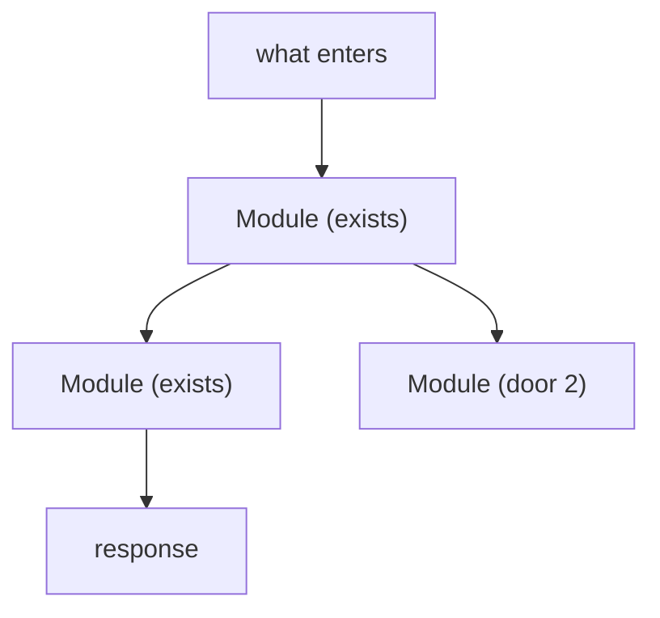

# Plan

**Goal:** the one artifact a human reads to understand the work and object to it, **before** any
claim carries a test selector. Two halves: what must be true, then what is being built.

They are one file because they are one activity and one review. Reading forty checks to
reconstruct what is being built is not planning, and deriving the obligations in the same pass
that decides the shape produces checks that ratify whatever was already assumed. So this gets
confirmed, and only then does [checks.md](checks.md) turn it into obligations with proofs.

Skip this file only when the change is under roughly three files with no one-way door - then
write the intent paragraph straight into `checks.md`.

## Before asking anything

**Load confirmed lessons.** `--root` is a parent flag and has to come before the
subcommand: `python3 <skill-dir>/scripts/lessons.py --root <project> list --status confirmed`
(add `--scope` or `--query` for the area this feature touches). Confirmed only - never
`candidate` or `quarantined`. No store yet, or no code tool: skip silently.

**Read `.specs/STATE.md` `## Decisions`.** Every `active` `AD-NNN` is a project-level constraint
the shape must conform to. Where one conflicts with what is best for this feature, there are two
options and both are explicit: conform, or append a new entry that supersedes the old one
(setting the old row's status to `superseded by AD-NNN`) and say why. Silently ignoring an active
decision creates an inconsistency nobody can find later.

**Scan the code this feature touches.** Neighbouring features, the existing conventions, the
terms already in use. This grounds the questions in reality, it is where you find that the source
names things the system does not have, and it is what the shape gets built from.

**Facts you look up; decisions you ask.** Anything the environment answers - a convention, an
existing field, how the current endpoint behaves, what the schema allows - you resolve yourself
through the knowledge chain: existing code and conventions, project docs, library documentation,
web search, then flag as uncertain. Never invent an API, a flag or a behaviour; a fabrication
here propagates into the checks and then into a green test that proves nothing. A question you
could have answered by reading the code spends the user's turn and their patience, and enough of
them turn this into an interview. Ask only what is genuinely theirs: scope, priority, product
behaviour, which trade-off they want.

**A bet that is still open does not get placed here.** Whether this is a job or a request cycle,
whether the state machine belongs in the model or a service, which of two architectures to commit
to - when that is genuinely undecided it needs each option costed against this repository and the
condition that would make the other one win, and the only shape this file has for a decision is a
`Landing` row. Squeezing one in produces a bet nobody reviewed, recorded where nobody looks for
one. Settle it first with whatever the project uses - an ADR, an RFC, a spike - and link it. This
file records the shape that won and makes it reviewable.

# Part one: what must be true

## Recover the problem

The source usually arrives as a solution. Write the problem in the present tense with no
solution inside it: what is true today that should not be, who pays for it, and what it costs
them. "We have no Stripe integration" is not a problem - it is the absence of this feature's
answer, and phrased that way it can only justify the thing already chosen. "Anyone evaluating
the product has to enter a card first" is a sentence someone can disagree with, and being
disagreeable is the test.

Copy the evidence the source gives, literally - a conversion figure, a support volume, a date
somebody else set. Where it gives none, say so rather than manufacturing urgency.

**Challenge vagueness.** "Good" means what? "Users" means who? "Simple" means how? Make the
abstract concrete: walk me through using this.

## How to ask, when you have to ask

Most of what looks like a question is not one. **A gray area is a decision that is genuinely the
user's, has more than one defensible answer, and is not settled by the code.** Fail any of the
three and it is not a gray area: the repo's conventions answer it, or one option is clearly right
and you state it as an assumption and move on. Do not go looking for a quota of them - a quota
manufactures questions the same way a checklist with no `n/a` escape manufactures requirements.

**What you do not know is findable, and the next two sections are the two lists that find it.**
`## Observable` below walks the surfaces this feature exposes, because every surface carries the
same decisions every time; the nine dimensions after it walk the system properties. Neither is a
prompt to think harder - both are enumerations, for the same reason: "consider the edge cases"
finds nothing, and a fixed list with a mandatory `n/a` escape finds the item nobody mentioned.

Where you do ask, these are the rules, and they are about turn cost rather than politeness. Every
badly shaped question spends a turn and buys less than a stated default would have.

- **Concrete options, never an open prompt.** "Card layout or table layout" is answerable; "how
  should this look?" hands the work back.
- **Lead with your recommendation and one line of why.** You have read the code; accepting or
  overriding should cost one word.
- **Assume first when it is safe.** State the default and invite correction instead of blocking.
  A question you would have answered the same way regardless of the reply is not worth asking.
- **At most two independent questions per turn, exactly one when they are dependent** - a
  dependent answer prunes the questions after it, so asking them together wastes most of them.
  Three or more in a turn is an interrogation, and it reads as one.
- **"You decide" is an answer.** Record it as an assumption with `Confirmed? y` and the rationale
  `user delegated`, so discretion is on the record rather than inferred from silence later.
- **The boundary is fixed.** Asking clarifies *how*, never whether to add a capability. A new
  capability that surfaces goes in `Out of scope` with its reason and stays there.

Anything asked and not answered, or that you chose not to raise, lands in `## Assumptions` with
your chosen default and rationale and `Confirmed? n`. That column is the whole record of who
decided what: `y` means a human said so. Never mark `y` for a default nobody saw.

## Walk the surfaces

A surface is anything outside the system that meets it, and each kind carries the same decisions
every time it appears. That is what makes them findable rather than a matter of remembering: you
do not ask "what did I forget about this screen", you walk the row.

| Surface | The decisions it always has |
| --- | --- |
| a screen or view | empty, loading, error and unauthorised states; density and ordering; what a destructive action confirms before doing it |
| an API or webhook someone calls | response shape, error shape with its codes, who may call it, versioning, what happens at the rate limit |
| a command or scheduled task | output format and verbosity, every flag and its default, exit codes, what it prints when it fails halfway |
| a document or copy someone reads | structure, tone, depth, and what the reader is meant to do next |
| a collection being organised | the grouping criterion, naming, ordering, what happens to duplicates, and the exception that does not fit |

Nothing about state, persistence or contracts is here - that is the nine dimensions below, and
duplicating it in both places produces two answers that disagree.

**Each item resolves to a criterion, to something that already behaves that way, or to an explicit
`n/a - <reason>`.** The `n/a` escape is mandatory and it is what stops the list from inventing
scope: a webhook has no empty state, and saying so costs a line. `None - no user-facing surface`
is a complete answer for a feature that exposes none.

Two of these hide better than the rest. An **error shape** is decided by whoever writes the first
handler, so it gets decided by accident and then copied. An **empty state** is invisible until the
feature ships to someone whose account is new, which is every user on their first day.

**Where the record lives:** `## Observable` in this file, one row per item, because each lands on
a criterion rather than on a check.

## Write the criteria in EARS

Every acceptance criterion resolves to exactly one pattern. Pick the one that fits instead of
forcing everything into WHEN/THEN.

| Pattern | Keyword | Template | Use for |
| --- | --- | --- | --- |
| Ubiquitous | (none) | The [system] SHALL [response] | always-on invariants |
| Event-driven | WHEN | WHEN [trigger] THEN the [system] SHALL [response] | a response to a discrete trigger |
| State-driven | WHILE | WHILE [state] the [system] SHALL [response] | behaviour that holds during a state |
| Optional-feature | WHERE | WHERE [feature is present] the [system] SHALL [response] | behaviour behind a flag or optional capability |
| Unwanted-behaviour | IF / THEN | IF [undesired condition] THEN the [system] SHALL [response] | errors, failures, invalid input, timeouts |
| Complex | combination | WHILE [state], WHEN [trigger] the [system] SHALL [response] | the above combined |

The patterns exist so that failure states, state transitions and optional behaviour become
first-class criteria instead of footnotes squeezed into a subordinate clause of some other
line. That is the whole reason not to use one shape.

**Rules.** One requirement per criterion, never two behaviours bundled. Concrete values - a
status code, a field, a bound - never "quickly", "gracefully" or "properly". Every criterion
contains a SHALL and is measurable. Edge cases are criteria, usually IF/THEN, not a separate
list.

**One run must settle it.** A percentile, an average, an uptime or an error rate is a service
target, not a criterion: no single execution can satisfy or fail it. Split the line - the
behaviour becomes the criterion, and the target lands on the observability dimension of the
sweep. Fused, the provable half hides behind the unprovable one and a test that never touched
the number marks the whole line green.

**A guarantee that something will not happen needs a mechanism.** Nothing prevents a duplicate
or a double charge by default, so "a retry does not create a second subscription" is a claim
about machinery. Point at the code that enforces it, or make it a one-way door in `Landing`
below. Walk the failure that would produce the forbidden thing - the remote call succeeded and
the local write did not - because that is the path nobody pictures. Where no mechanism exists it
is a door or a question, never a criterion standing alone.

## Sweep the nine dimensions

The source covers what somebody thought of. This is the list of what nobody writes down, and
it is fixed so a blank cannot look like nothing to answer:

| Dimension | What to cover |
| --- | --- |
| Validation and bounds | limits, formats, sanitization |
| Failure and partial failure | timeouts, partial saves, rollbacks |
| Idempotency, retry, duplicates | safe retries, dedup keys |
| Authorization and rate limits | who can call what, throttling |
| Concurrency and ordering | races, ordering guarantees |
| Data lifecycle | TTL, archival, deletion, backfill |
| External-dependency failure | circuit breakers, fallbacks |
| State transitions | valid transitions, guards |
| Observability | logging, metrics, tracing |

Walk all nine. Each resolves to a criterion, to something the code already handles, or to an
explicit `n/a because [reason]`. The `n/a` escape is mandatory - it is what stops the list from
manufacturing requirements. Where a dimension needs a product answer it becomes an open
question, never a criterion you invented.

Concurrency and observability hide better than the other seven, because neither is visible to
a user until it fails. Those two are why this list exists.

A landing must observe **that** dimension. Reaching for a number already used on another line
is the tell that the dimension is uncovered: a duplicate rejected because a row already exists
says nothing about two requests arriving at once. When you catch yourself borrowing, the honest
answers are `n/a` with the reason, or a question.

**Where the record lives:** the landing for each dimension is written in `checks.md` under
`## Swept`, because each one has to cite a check number. Do not duplicate it here.

# Part two: what is being built

Five sections, each bounded by a rule about what stays out. That boundary is the whole point:
the design half of most spec-driven flows fails not because designing is wrong but because the
document accumulates a component catalogue - `Purpose`, `Location`, `Interfaces`,
`Dependencies` per class - which is reversible detail, goes stale within weeks, and then
misleads the next reader with the authority of a written document. None of those fields exists
here.

## Flow - the path, not the catalogue

Open with one or two sentences on what this reuses instead of duplicating - the verifier that
already exists, the job that already prunes, the policy that already decides. That sentence is a
decision, and it is the one that keeps a second implementation of an existing thing from landing
in the diff. It replaces a code-reuse table: each hop below already marks whether its module
exists, so the inventory is distributed through the path and the sentence carries only the choice.

Then one line per hop, in order: what enters, which module it crosses, what it hands to the next,
and what persists or goes out at the end. This is the map a reviewer reads the `Landing` rows
against, and what a second builder needs so it does not rebuild a hop that exists.

**Name only modules that exist today, or that `Landing` creates as a door.** A component that is
neither is placement - reversible, answered by the repo's conventions, settled in the diff. That
single rule is what keeps this from becoming the catalogue.

`single module - <name>` is a complete answer, and most features are that. The section is
required anyway: a feature crossing four modules and one crossing one have to be distinguishable
without reading the whole artifact.

**When the path is not linear, draw it instead.** A numbered list cannot express one event
fanning out to three independent handlers, a fork that takes one of two paths, or a hop that
enqueues and returns while the work happens later - and flattening any of those into a sequence
describes a system that does not exist. Use a mermaid `flowchart` for exactly those cases, with
the same rule: every module node carries `(exists)` or the door that creates it, or it is
placement and does not belong here.

The diagram is the exception and the list is the default, for a reason that is not aesthetic:
`Flow` is **kept true** through the build, and a list is cheap to correct in the commit that
changes the path while a diagram quietly rots. Reach for it when the shape genuinely branches,
not to make a three-hop line look considered.

## Relations - the stored shape

Only when this changes the shape of stored data, and only what `Landing` settled: entities,
cardinality, and the constraints that are one-way. **No columns, no types.** Those are
reversible, they come from the repo's conventions, and putting them here produces the diagram
that disagrees with the schema in three months.

`None - no stored-data shape change` is complete.

## Surface - the signature

Only when this adds or changes an interface something outside it consumes. The **signature, not
a specification**: route, what goes in, what comes out, which statuses. A payload key stops
being yours to rename the moment something outside this codebase reads it, which is why this is
a review and not documentation.

Do **not** put check numbers here - checks do not exist yet. Each route's statuses become a set
row in the `Coverage` join in `checks.md`, which is what proves none of them went unclaimed.

`None - nothing consumed outside` is complete.

## Landing - the one-way doors

A door is one-way when reversing it costs more than a refactor: a persisted schema, a contract
someone else consumes, a new dependency, a data backfill, and a pattern the codebase does not
have yet - precedent stops being reversible once the next features have copied it.

Each row shows the **literal shape** the next person will copy and what you rejected, named with
the property that disqualified it: "cleaner" cannot be argued with, "cannot express the next
state" can. Where the choice was forced rather than compared, name the constraint that forced
it. Keep the row short - `Relations` and `Surface` carry the diagram and the signature.

`None - <why nothing here is one-way>` is a complete answer, and stating it is what makes the
omission contestable.

Two things look like doors and are not. Scope ("V1 does not charge") reverses by doing the next
slice and already lives in `Out of scope` above. A rule with no mechanism ("one trial per user")
reverses by changing a condition; it becomes a door only once something persisted enforces it,
and then the row is the unique index with its literal definition, not the rule.

A column or a type belongs here whenever it is a door, and the tell is never the word "column".
Identifier width is a type and irreversibly a door. Uniqueness decides product behaviour.
Nullability over a populated table is a data-dependent migration. A field a consumer binds to
stops being yours to rename. Everything else about the schema - names, indexes, ordinary types -
is settled while building.

Weigh the rejection against what comes after this feature. A constraint that settles the problem
in front of you can forbid something a later slice needs, and when a door reaches past the
boundary, say what it closes. When a decision needs a paragraph to justify itself, it is an ADR
or an RFC and it comes **before** this file: write it, link it, keep the row literal.

**A door that reaches past this feature also belongs in `.specs/STATE.md` `## Decisions`** - the
shape here, the constraint there. See [memory.md](memory.md).

## Impact - what gets disturbed

What already exists and changes underneath. "Nothing" is a valid answer; a missing row is not.

The domain rows matter more than they look. A name leaks - it becomes a class, a column, a
payload key, a route - so naming is a one-way door that does not look like one. For a term that
changes meaning, name **who branches on it today**: those callers never appear in the feature's
diff. Past two terms, give each its own row; six terms in one cell cannot show a gap.

The stored-data row is about what runs against existing data, not only about rows you move. A
unique index over a column that was never unique fails on the first pair that already exists, in
production, against real rows.

# Closure gate

Before presenting the plan, five checks. Nothing proceeds unresolved **and** unmarked.

1. **Unambiguity and precision.** Every criterion has a single interpretation and a precise
   expected outcome. One that fails either gets resolved with the user, split, or logged as an
   assumption with the chosen interpretation and its rationale.
2. **Assumptions closure.** Every unresolved decision that surfaced is either resolved or
   recorded in `## Assumptions` with a chosen default and a rationale - including every gray area
   you chose not to raise and every one the user declined. Silently dropped is the failure this
   check exists for; a default nobody saw is fine, a default nobody can find is not.
3. **Blocking questions are marked as such.** A question that stops a criterion from ever being
   satisfiable is different in kind from one that leaves an error payload undecided. So is one
   that blocks nothing technical and still stops the feature reaching real users - a catalog
   nobody populated, a credential nobody issued. Three kinds: `blocks`, `blocks go-live`,
   `open`.
4. **Both enumerations are walked, not skimmed.** Every item of every surface present has a
   landing in `## Observable`, and all nine dimensions have one in `checks.md`. A blank in either
   is the failure both lists exist to make visible.
5. **Every criterion has somewhere to land in the shape.** A criterion whose behaviour crosses
   no hop in `Flow`, touches nothing in `Relations` and appears on no route in `Surface` is
   either out of scope or a gap in the shape. This is the check the two halves being one file
   buys, and it is the reason to write them in one sitting.

This gate clarifies existing requirements; it never invents new ones. `Out of scope` and the
sweep's `n/a` escape are the counterweights.

**Run it, do not eyeball it:**

```bash
python3 <skill-dir>/scripts/validate_plan.py <feature>
```

It fails a missing or empty section, a criterion that is not EARS-shaped, an assumption row with
an empty default or rationale, a malformed requirement ID, an `Observable` row whose landing is
blank or whose `n/a` carries no reason, a `Landing` row with no literal shape or no rejected
alternative, a `Relations` block that names columns or types, a `Surface` row
missing its statuses, and check numbers written into `Surface` before checks exist. It warns on a
`Flow` hop naming a module marked neither as existing nor as a door. Judgment calls stay yours.

## Template: `.specs/features/<feature>/plan.md`

`````markdown
# <Feature>

Sources:

- <ticket URL / document path / "conversation"> - <what it settles>
- <design> - **binding for the interface**: screens <ids>, and where the copy lives

## Problem

<Present tense, no solution inside it: what is true today that should not be, who pays for it,
what it costs them. The evidence the source gives, copied literally - or a note that it gives
none.>

<What is different for a user when this ships.>

## Out of scope

| Excluded | Why |
| --- | --- |
| <capability> | <reason> |

## Assumptions

| Assumption | Chosen default | Rationale | Confirmed? |
| --- | --- | --- | --- |
| <ambiguity> | <what we will do> | <why> | y/n |

**Open questions:** none - all resolved or logged above.

<Or, when something genuinely stayed open:>

| # | Kind | Question | Until answered |
| --- | --- | --- | --- |
| 1 | blocks | <question> | <which criterion cannot be satisfied> |
| 2 | blocks go-live | <question> | <what cannot be switched on for real users> |
| 3 | open | <question> | <what stays imprecise, and what was written meanwhile> |

## Criteria

Grouped by slice - one observable outcome each, never a layer. Numbering runs across the whole
plan. A screen names its screen and gives every state that matters its own line: empty, loading,
error, unauthorised.

### S1: <slice - the outcome someone can watch> (P1)

**Acceptance Criteria**

1. WHEN <trigger> THEN the system SHALL <observable outcome with the concrete value>
2. IF <undesired condition> THEN the system SHALL <response>
3. WHILE <state holds> the system SHALL <behaviour>
4. The system SHALL <always-on invariant with its concrete value>

**Independent test:** <how to demo this slice alone>

### S2: <slice> (P2)

**Acceptance Criteria**

5. WHEN <trigger> THEN the system SHALL <outcome>

**Independent test:** <how to demo>

## Traceability

| ID | Slice | Criteria | Status |
| --- | --- | --- | --- |
| FEAT-01 | S1 | 1, 2, 3 | Pending |
| FEAT-02 | S2 | 5 | Pending |

**ID format:** `CATEGORY-NUMBER`, e.g. `AUTH-01`. **Status:** Pending → In checks →
Implementing → Verified.

## Observable

Every item of every surface this feature exposes. `n/a` needs its reason.

| Surface | Decision | Landing |
| --- | --- | --- |
| screen `<name>` | empty state | AC <n> |
| screen `<name>` | error state | AC <n> |
| screen `<name>` | destructive action confirms | existing - <the pattern already in use> |
| API `<METHOD> /<path>` | error shape and codes | AC <n> |
| API `<METHOD> /<path>` | versioning | n/a - <why it does not apply> |

<Or:> `None - no user-facing surface`

## Flow

<One or two sentences: what this reuses instead of duplicating.>

1. <what enters> -> `<Module>` (exists) - <what it does, what it hands on>
2. `<Module>` (exists) - <what it does>, persists `<Entity>` (door <n>)
3. `<Module>` (new, no door - placement per conventions) - <what it decides>
4. out: `<response>`, and `<Module>` (exists) reads `<field>` on the next request

<Or, for most features:> `single module - <Name>`

<Or, only when the path branches, fans out, or hands off asynchronously:>



## Relations

```mermaid
erDiagram
    <Entity> ||--o{ <Entity> : "<verb>"
    <Entity> ||--|| <Entity> : "<field> - unique, door <n>"
```

One-way constraints: <field> unique (door <n>), <field> not null with <value> in the enum
(door <n>). No columns and no types here.

<Or:> `None - no stored-data shape change`

## Surface

| Route | In | Out | Status |
| --- | --- | --- | --- |
| `<METHOD> /<path>` | `<field>`, `<field>` | `<field>` · `<field>` | `<code>`, `<code>`, `<code>` |

<Or:> `None - nothing consumed outside`

## Landing

| One-way door | Literal shape | Alternative rejected |
| --- | --- | --- |
| <what> | <enum value, unique index, dependency - the literal a reader copies> | <the option, and the property that disqualified it> |

- Nothing else in this change is hard to reverse

## Impact

| Front | What changes |
| --- | --- |
| domain | new term: `<Name>` - <one-line definition>, lives in <module> |
| domain | existing term: `<Name>` meant <x>, now means <y> - <who branches on it today> |
| stored data | <backfill now / migrate on read / dual write / nothing to migrate> |
`````

## Then confirm, and only then write checks

**This is the one place worth stopping for a human by default.** Present the plan and stop: the
criteria are what everything downstream traces to, and the doors are the rows that cost the most
to raise late. Where a `Landing` door has a live alternative, `Relations` changes the shape of
data that already exists, `Surface` changes something already consumed, or `Impact` names a term
whose meaning shifts under existing callers - say so explicitly rather than burying it in the
table, because those are the four a reviewer would want pointed at.

Then continue into [checks.md](checks.md). Every route's statuses, every door, and every entity
here owes a set row or a check there - that derivation is the next step's job, and it is the one
that catches what this file left implicit.

## Notes

- **P1 is a vertical slice** - a complete, demo-able outcome, not a layer.
- **A criterion you cannot imagine a test for is not ready.** You do not name the test here;
  that happens in `checks.md`, against the repo's real test setup.
- **Priority tags are advisory.** They order the work; they never scale down verification.
- The two halves are written in one sitting, and the shape is written **after** the criteria -
  the order is what stops a criterion from being invented to justify a component.
