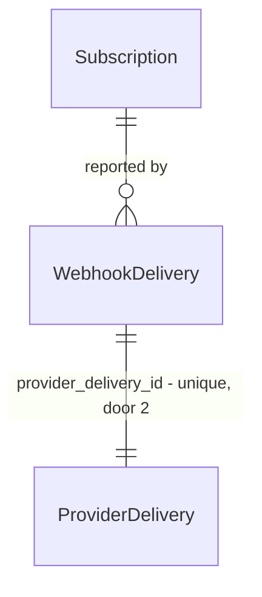

# Dunning on failed charge

Sources:

- TLC-412 - the suspension rule and the 11-day evidence
- provider webhook reference - the 9 statuses and the 5 event types

## Problem

A member whose card fails keeps full access until someone notices in the provider dashboard,
which took 11 days on the last three cases. Support absorbs the refund argument and the member
learns that paying is optional.

When this ships, a failed charge suspends access within one billing cycle and the member sees why.

## Out of scope

| Excluded | Why |
| --- | --- |
| Retry schedule configuration | the provider already owns retries; duplicating it needs its own decision |
| Dunning emails | copy is not written yet, tracked separately |

## Assumptions

| Assumption | Chosen default | Rationale | Confirmed? |
| --- | --- | --- | --- |
| Grace period after the first failure | none - suspend on the first failed charge | the provider already retried 3 times before it reports a failure | y |
| Status for a member who was never charged | stays `Active` | absence of a charge is not a failure | y |

**Open questions:** none - all resolved or logged above.

## Criteria

### S1: Suspension on a failed charge (P1)

**Acceptance Criteria**

1. WHEN the provider reports a failed charge THEN the system SHALL set the subscription status to `Suspended`
2. IF the reported provider status is unknown THEN the system SHALL leave the status unchanged and record a `billing.status_unmapped` event
3. WHILE a subscription is `Suspended` the system SHALL deny access to paid access groups
4. The system SHALL never move a subscription directly from `Suspended` to `Trialing`

**Independent test:** replay a failed-charge webhook against a paying member and confirm access is denied.

### S2: Webhook ingest (P1)

**Acceptance Criteria**

5. WHEN a webhook delivery id has already been processed THEN the system SHALL return `200` and change no records
6. IF the provider payload is missing a subscription id THEN the system SHALL return `422` and persist nothing

**Independent test:** post the same delivery twice and confirm one row.

## Traceability

| ID | Slice | Criteria | Status |
| --- | --- | --- | --- |
| BILL-01 | S1 | 1, 2, 3, 4 | Pending |
| BILL-02 | S2 | 5, 6 | Pending |

## Observable

| Surface | Decision | Landing |
| --- | --- | --- |
| API `POST /webhooks/provider` | response shape | AC 5 |
| API `POST /webhooks/provider` | error shape and codes | AC 6 |
| API `POST /webhooks/provider` | who may call it | existing - signature verification in `Webhooks::Verifier` |
| API `POST /webhooks/provider` | versioning | n/a - the provider pins the payload version in the envelope |
| API `POST /webhooks/provider` | rate limit behaviour | n/a - inbound webhooks are not throttled; the provider owns retries |
| screen | n/a - this feature exposes no screen; the member sees the existing locked-community view |

## Flow

A failed charge suspends the subscription instead of cancelling it, and access follows the status.
Reuses the signature verifier already in `Webhooks::Verifier` rather than adding a second one, and
the existing 90-day pruning job for delivery rows.

1. provider `POST /webhooks/provider` -> `Webhooks::Verifier` (exists) - signature, then the envelope
2. `Webhooks::Ingest` (exists) - dedups on `provider_delivery_id`, persists `WebhookDelivery` (door 3)
3. `Billing::StatusMap` (new, no door - placement per conventions) - provider status -> local status
4. `Billing::Subscription` (exists) - applies the transition, persists `status`
5. out: `200` `{}`, and `AccessPolicy` (exists) reads `status` on the next request - no call from here

## Relations

One-way constraints: `provider_delivery_id` unique (door 2), `status` not null with `suspended`
in the enum (door 1). No columns and no types here - those come from the repo's conventions and
are settled in the diff.

## Surface

| Route | In | Out | Status |
| --- | --- | --- | --- |
| `POST /webhooks/provider` | the provider envelope as sent | `{}` · `{error}` | `200`, `409`, `422` |

## Landing

| One-way door | Literal shape | Alternative rejected |
| --- | --- | --- |
| `subscriptions.status` gains `suspended` | enum value, not null, existing rows backfilled to `active` | a boolean `is_suspended` - cannot express the next state |
| delivery id uniqueness | unique index on `webhook_deliveries.provider_delivery_id` | dedup in application code - two workers race past it |
| new entity `WebhookDelivery` | one row per delivery, keyed on the provider's delivery id | a column on `subscriptions` - one row per delivery, not per subscription |
| `POST /webhooks/provider` response codes | `200` on accepted or replayed, `409` on a concurrent duplicate, `422` on a missing subscription id | `204` - the provider retries anything without a body |

- Nothing else in this change is hard to reverse

## Impact

| Front | What changes |
| --- | --- |
| domain | new term: `Suspended` - a subscription whose last charge failed and whose access is revoked, lives in `Billing` |
| domain | existing term: `Active` meant "has a subscription row", now means "has a subscription row and the last charge succeeded" - `AccessPolicy#grant?` and the admin index branch on it today |
| stored data | backfill now: every existing row gets `active`; the unique index runs against 40k delivery rows and fails if a duplicate already exists, so dedup the table first |
